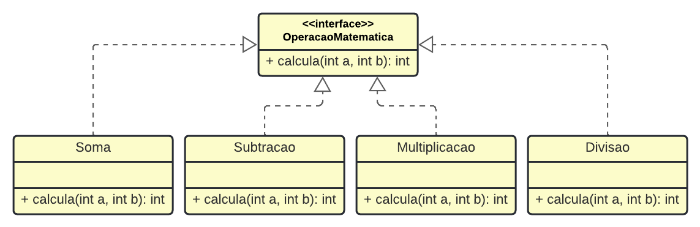

# Classes Abstratas e Interfaces

## Exercicios

1. Implemente, em Java, uma classe abstrata de nome Quadrilatero onde são declarados dois métodos abstratos: 
    - float calcularArea();
    - float calcularPerimetro();

2. Crie, como subclasse de Quadrilatero, uma classe de nome Retangulo cujas instâncias são caracterizadas pelos atributos lado e altura ambos do tipo float.
    >Implemente na classe Retangulo os métodos herdados de Quadrilatero e outros que ache necessários.

3. Implementar uma aplicação que declara uma Interface do tipo OperacaoMatematica que deve realizar uma operação matemática e imprimir o seu resultado, de acordo com o diagrama abaixo.
    - OBS 1: Não defina a e b como atributos. 
    - OBS 2: Implemente um construtor padrão para cada uma das classes.

